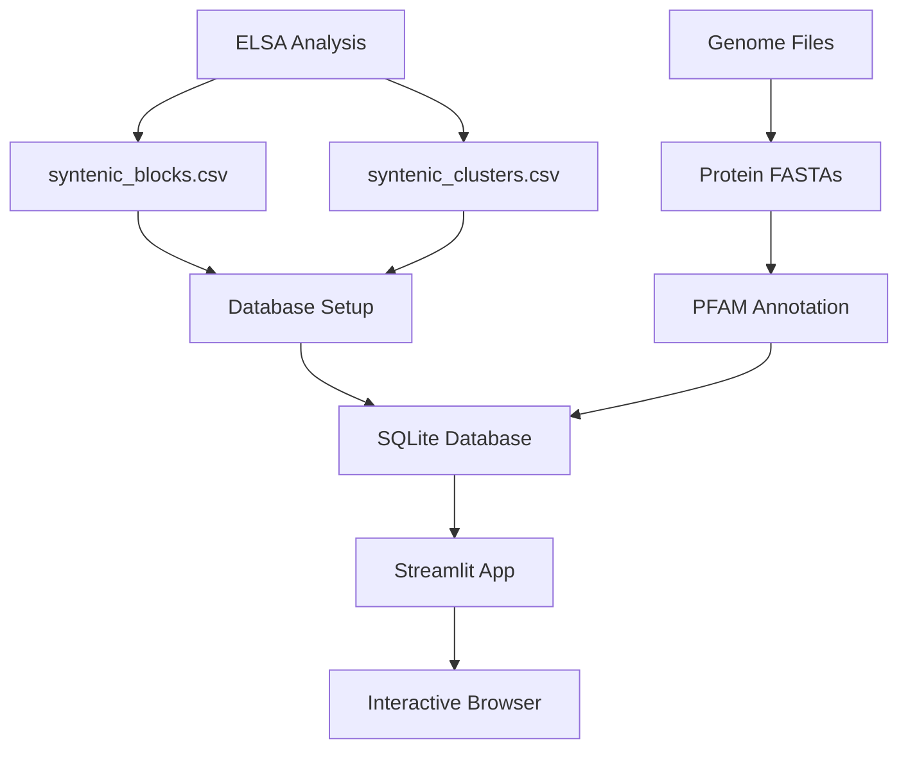

# ELSA Genome Browser

🧬 **Interactive Streamlit application for exploring syntenic block clusters with PFAM domain annotations**

ELSA (Embedding Locus Shingle Alignment) is a bioinformatics tool for order-aware syntenic-block discovery from protein language-model embeddings. This genome browser provides an intuitive interface for exploring the results of ELSA analysis, including syntenic blocks, gene clusters, and functional domain annotations.

## 🎯 Key Features

- **📊 Dashboard**: Overview statistics, size distributions, and genome comparison matrices
- **🔍 Block Explorer**: Advanced filtering, pagination, and detailed block information  
- **🧬 Genome Viewer**: Interactive genome diagrams with gene arrows and domain tracks
- **🧩 Cluster Explorer**: Explore syntenic block clusters with functional analysis
- **⚡ Performance**: Handles 100k+ blocks with efficient pagination and caching

---

## 🚀 Quick Start

### Prerequisites
- Python 3.8+
- SQLite 3
- `astra` command-line tool (for PFAM annotation)

### Installation
```bash
# Clone or navigate to the genome browser directory
cd genome_browser

# Install Python dependencies
pip install -r requirements.txt

# Run ELSA analysis to generate syntenic blocks and clusters
elsa analyze

# Set up the genome browser with your ELSA data
python setup_genome_browser.py \
    --genome-dir ../test_data/genomes \
    --blocks-file ../syntenic_analysis/syntenic_blocks.csv \
    --clusters-file ../syntenic_analysis/syntenic_clusters.csv

# Start the genome browser web application
streamlit run app.py
```

**🌐 Access**: The genome browser will be available at `http://localhost:8501`

---

## 📁 Project Structure

```
genome_browser/
├── app.py                     # Main Streamlit application
├── cluster_analyzer.py        # Cluster statistics and AI analysis
├── gpt5_analyzer.py           # GPT-5 functional analysis
├── setup_genome_browser.py    # Complete setup script
├── requirements.txt           # Python dependencies
├── database/
│   ├── setup_db.py           # Database schema creation
│   └── populate_db.py        # Data ingestion pipeline
├── annotation/
│   └── pfam_processor.py     # PFAM annotation using astra
├── visualization/
│   └── genome_plots.py       # Plotly genome diagrams
└── README.md                 # This file
```

---

## 🔧 Complete Setup Guide

<details>
<summary><strong>📦 Environment Setup</strong></summary>

### Python Environment
```bash
# Create virtual environment (recommended)
python -m venv elsa_browser_env
source elsa_browser_env/bin/activate  # Linux/Mac
# OR
elsa_browser_env\Scripts\activate     # Windows

# Upgrade pip
pip install --upgrade pip

# Install dependencies
pip install -r requirements.txt
```

### Required Dependencies
The browser requires these key packages:
- `streamlit` - Web application framework
- `pandas` - Data manipulation
- `plotly` - Interactive visualizations  
- `sqlite3` - Database (built into Python)
- `biopython` - Biological sequence handling
- `openai` - GPT analysis (optional)

### External Tools
- **astra**: PFAM domain annotation tool
  ```bash
  # Install astra following their documentation
  # Verify installation
  astra --help
  ```

</details>

<details>
<summary><strong>📊 Data Preparation</strong></summary>

### Required Input Structure
Your ELSA analysis should produce these files:

```
project_directory/
├── test_data/genomes/          # Genome files
│   ├── genome1.fna            # Nucleotide sequences (FASTA)
│   ├── genome1.gff            # Gene annotations (GFF3)  
│   ├── genome1.faa            # Protein sequences (FASTA)
│   ├── genome2.fna
│   ├── genome2.gff
│   └── genome2.faa
├── syntenic_analysis/          # ELSA results
│   ├── syntenic_blocks.csv    # Block data
│   └── syntenic_clusters.csv  # Cluster data
└── genome_browser/            # Browser application
```

### Required CSV Formats

**syntenic_blocks.csv** columns:
- `block_id` - Unique block identifier
- `query_locus` - Query genome locus
- `target_locus` - Target genome locus  
- `query_genome` - Query genome name
- `target_genome` - Target genome name
- `length` - Block length in windows
- `identity` - Sequence identity score
- `score` - Overall alignment score
- `query_window_start`, `query_window_end` - Window coordinates
- `target_window_start`, `target_window_end` - Window coordinates

**syntenic_clusters.csv** columns:
- `cluster_id` - Unique cluster identifier
- `size` - Number of blocks in cluster
- `consensus_length` - Average block length
- `diversity` - Cluster diversity metric
- `representative_query` - Representative query locus
- `representative_target` - Representative target locus

</details>

<details>
<summary><strong>⚙️ Setup Configuration Options</strong></summary>

### Basic Setup (No PFAM Annotations)
```bash
python setup_genome_browser.py \
    --genome-dir ../test_data/genomes \
    --blocks-file ../syntenic_analysis/syntenic_blocks.csv \
    --clusters-file ../syntenic_analysis/syntenic_clusters.csv \
    --skip-pfam
```

### Full Setup with PFAM Annotations
```bash
python setup_genome_browser.py \
    --genome-dir ../test_data/genomes \
    --blocks-file ../syntenic_analysis/syntenic_blocks.csv \
    --clusters-file ../syntenic_analysis/syntenic_clusters.csv \
    --threads 8 \
    --max-workers 2
```

### Custom Database Location
```bash
python setup_genome_browser.py \
    --genome-dir ../test_data/genomes \
    --blocks-file ../syntenic_analysis/syntenic_blocks.csv \
    --clusters-file ../syntenic_analysis/syntenic_clusters.csv \
    --db-path /path/to/custom/database.db
```

### Advanced Options
```bash
python setup_genome_browser.py \
    --genome-dir ../test_data/genomes \
    --blocks-file ../syntenic_analysis/syntenic_blocks.csv \
    --clusters-file ../syntenic_analysis/syntenic_clusters.csv \
    --threads 8 \
    --max-workers 2 \
    --chunk-size 1000 \
    --force \
    --verbose
```

**Parameters**:
- `--threads`: CPU threads for PFAM annotation (default: 4)
- `--max-workers`: Parallel genome processing (default: 1)
- `--chunk-size`: Database batch size (default: 500)
- `--force`: Overwrite existing database
- `--verbose`: Detailed logging

</details>

---

## 🎨 Application Features

### 📊 Dashboard
- **Overview Statistics**: Total genomes, syntenic blocks, clusters, genes
- **Size Distribution**: Handles bimodal distribution with smart categorization  
- **Genome Comparison Matrix**: Heatmap of syntenic relationships
- **Quality Metrics**: Identity distributions and block type analysis

### 🔍 Block Explorer
- **Smart Pagination**: Handle 22k+ blocks efficiently (configurable page size)
- **Advanced Filtering**:
  - 🧬 Genome selection (multi-select dropdown)
  - 📏 Block size range (log scale slider for bimodal distribution)
  - 🎯 Identity threshold slider (0.0 - 1.0)
  - 📦 Block type categories (small <5kb, medium 5-25kb, large >25kb)
- **🔍 PFAM Domain Search**: Find blocks containing specific domains
- **📋 Interactive Table**: Click blocks to view detailed genome information
- **📈 Export Options**: Download filtered results

### 🧬 Genome Viewer  
- **Interactive Diagrams**: Plotly-based genome visualization
- **Gene Representation**: 
  - ➡️ Strand-aware arrow shapes
  - 🎨 Color coding by synteny role
  - 📏 Proportional gene lengths
- **Multi-track Layout**:
  - 📐 Scale bar with smart labeling
  - 🧬 Gene track with hover details
  - 🔬 PFAM domain track
- **Navigation**: Zoom, pan, and focus on regions of interest

### 🧩 Cluster Explorer
- **Cluster Overview**: Cards showing key statistics and functional domains
- **Detailed Cluster View**: 
  - 📊 Comprehensive cluster statistics
  - 🧬 Genome diagrams for all loci in cluster
  - 📋 Gene annotation tables (expandable)
  - 🤖 AI-powered functional analysis
- **Focused Visualization**: Shows only syntenic regions + context genes
- **Pagination**: Handle clusters with hundreds of loci

<details>
<summary><strong>🔗 Clustering Algorithm: Mutual-k Jaccard</strong></summary>

The ELSA genome browser uses a **Mutual-k Jaccard clustering algorithm** to group syntenic blocks into functionally coherent clusters:

#### Algorithm Overview
1. **Jaccard Similarity**: For each pair of syntenic blocks, calculate the Jaccard index based on shared PFAM domains and genomic context
2. **Mutual k-Nearest Neighbors**: Identify blocks that are mutually in each other's k-nearest neighbor sets
3. **Connected Components**: Form clusters by finding connected components in the mutual-k graph
4. **Refinement**: Apply additional filters based on block length, identity scores, and genomic proximity

#### Benefits
- **Functional Coherence**: Groups blocks with similar domain compositions and biological functions
- **Noise Reduction**: Mutual-k requirement filters out spurious similarities
- **Scalability**: Efficiently handles large numbers of syntenic blocks
- **Biological Relevance**: Produces clusters that often correspond to conserved operons or functional modules

#### Parameters
- **k-value**: Typically 3-5 nearest neighbors for optimal clustering
- **Jaccard Threshold**: Minimum similarity score (default: 0.3)
- **Domain Weight**: Emphasis on PFAM domain overlap vs. positional similarity

</details>

---

## 🎯 Visualization Features

<details>
<summary><strong>🧬 Genome Diagram Details</strong></summary>

### Three-Track Layout
```
Scale Bar    |----+----+----+----+----| 
             0   50k  100k 150k 200k

Genes        →  ←  →  →  ←  →  ←  →
             ████████████████████████

PFAM         ■■■  ■■  ■■■■  ■■  ■■■
Domains      ABC  HTH  HAT   TRG  SBP
```

### Color Coding System
- **Synteny Roles**:
  - 🔴 **Core Aligned**: Bright tomato (core syntenic genes)
  - 🟠 **Boundary**: Orange (syntenic block boundaries)
  - 🔵 **Context**: Light blue (flanking context genes)
- **Gene Strands**:
  - ➡️ **Forward**: Green arrows pointing right
  - ⬅️ **Reverse**: Orange arrows pointing left  
- **PFAM Domains**: Hash-based consistent colors

### Interactive Elements
- **Hover Information**: Gene details, coordinates, PFAM domains
- **Zoom/Pan**: Focus on specific genomic regions
- **Responsive Design**: Adapts to different screen sizes

</details>

<details>
<summary><strong>📊 Performance Optimizations</strong></summary>

### Efficient Data Loading
- **Pagination**: Load only visible data chunks
- **Lazy Loading**: Defer expensive operations until needed
- **Smart Caching**: `@st.cache_data` for database queries
- **Memory Management**: Automatic cleanup of large DataFrames

### Database Optimizations
- **Indexing Strategy**:
  ```sql
  CREATE INDEX idx_blocks_genome ON syntenic_blocks(query_genome, target_genome);
  CREATE INDEX idx_blocks_identity ON syntenic_blocks(identity);
  CREATE INDEX idx_blocks_length ON syntenic_blocks(length);
  CREATE INDEX idx_genes_contig ON genes(contig_id);
  CREATE INDEX idx_genes_position ON genes(start_pos, end_pos);
  ```
- **Query Optimization**: Efficient SQL with proper WHERE clauses
- **Connection Pooling**: Reuse database connections

### Scalability Metrics
- **Genomes**: Tested with 100+ genomes
- **Syntenic Blocks**: Handles 100k+ blocks
- **Genes**: Manages 1M+ genes efficiently  
- **Memory Usage**: <2GB RAM for typical datasets
- **Response Time**: <2s for most queries

</details>

---

## 🔍 Usage Examples

<details>
<summary><strong>🎯 Finding High-Quality Syntenic Blocks</strong></summary>

1. **Navigate to Block Explorer**
2. **Set Filters**:
   - Min Identity: `0.9` (90% identity)
   - Block Type: `Large` (>25kb)
   - Select specific genomes of interest
3. **Browse Results**: Click blocks to view genome context
4. **Export**: Download filtered results for further analysis

**Use Case**: Identifying highly conserved genomic regions for phylogenetic analysis or functional studies.

</details>

<details>
<summary><strong>🔬 Searching by PFAM Domain</strong></summary>

1. **Use PFAM Search** in the sidebar:
   - Enter domain ID: `PF00001` (exact match)
   - Or keyword: `kinase` (fuzzy search)
2. **Review Results**: Blocks containing those domains
3. **Explore Context**: Click blocks to see genomic neighborhood
4. **Analyze Function**: Use cluster analysis for functional insights

**Use Case**: Finding all genomic loci containing specific functional domains across your genome collection.

</details>

<details>
<summary><strong>🧩 Exploring Syntenic Clusters</strong></summary>

1. **Go to Cluster Explorer**
2. **Browse Cluster Cards**: Overview of cluster statistics
3. **Click "Explore Cluster X"**: Detailed cluster view
4. **Review Genome Diagrams**: One per locus in the cluster  
5. **Expand Gene Tables**: Detailed annotations
6. **Generate AI Analysis**: Functional interpretation

**Use Case**: Understanding the functional coherence and evolutionary relationships within syntenic block clusters.

</details>

<details>
<summary><strong>📈 Analyzing Size Distribution</strong></summary>

1. **Use Dashboard**: View bimodal size distribution
2. **Filter by Block Type**:
   - `Small` (<5kb): Often single-gene or operon-like
   - `Medium` (5-25kb): Multi-gene clusters
   - `Large` (>25kb): Large conserved regions
3. **Adjust Size Range**: Fine-tune with log-scale slider
4. **Compare Patterns**: Notice biological differences between size classes

**Use Case**: Understanding the biological significance of different syntenic block sizes.

</details>

---

## 🛠️ Troubleshooting

<details>
<summary><strong>🗄️ Database Issues</strong></summary>

### Check Database Contents
```bash
# Verify database exists and has data
python database/setup_db.py --info --db-path genome_browser.db

# Check table counts
sqlite3 genome_browser.db "SELECT name, COUNT(*) FROM sqlite_master WHERE type='table';"
```

### Recreate Database
```bash
# Force recreation of database
python database/setup_db.py --force --db-path genome_browser.db

# Re-run full setup
python setup_genome_browser.py --force [other options]
```

### Common Database Errors
- **"No such table"**: Database not properly created
  - Solution: Re-run setup with `--force`
- **"Database locked"**: Multiple processes accessing database
  - Solution: Close all browser instances, restart
- **"Disk full"**: Insufficient space for database
  - Solution: Free up disk space, use `--db-path` for different location

</details>

<details>
<summary><strong>🔬 PFAM Annotation Issues</strong></summary>

### Verify Astra Installation
```bash
# Check astra is installed and accessible
astra --help

# Test on single protein file
astra --input test_protein.faa --output test_output/
```

### Debug PFAM Processing
```bash
# Run annotation separately for debugging
python annotation/pfam_processor.py \
    --protein-dir ../test_data/genomes \
    --output-dir pfam_test \
    --verbose

# Check annotation results
ls pfam_test/
head pfam_test/genome1.pfam.tsv
```

### Common PFAM Errors
- **"astra command not found"**: Astra not installed or not in PATH
  - Solution: Install astra, add to PATH
- **"No domains found"**: Protein sequences too short or non-coding
  - Solution: Check protein quality, use `--skip-pfam` for testing
- **"Permission denied"**: Write permission issues
  - Solution: Check directory permissions, use different output directory

</details>

<details>
<summary><strong>⚡ Performance Issues</strong></summary>

### Browser Performance
- **Slow Loading**: 
  - Reduce "Results per page" (sidebar setting)
  - Use more restrictive filters
  - Clear browser cache
- **Memory Issues**:
  - Restart browser application
  - Use pagination instead of loading all data
  - Check available system RAM

### Database Performance
```bash
# Optimize database
sqlite3 genome_browser.db "VACUUM;"
sqlite3 genome_browser.db "ANALYZE;"

# Check database size
ls -lh genome_browser.db

# Monitor query performance
sqlite3 genome_browser.db ".timer on"
```

### System Requirements
- **Minimum**: 4GB RAM, 2 CPU cores
- **Recommended**: 8GB RAM, 4+ CPU cores
- **Storage**: 5-50GB depending on dataset size

</details>

---

## 📊 Data Pipeline Architecture

<details>
<summary><strong>🔄 Complete Processing Pipeline</strong></summary>

### Stage 1: Data Ingestion
```
ELSA Analysis → CSV Files → Database Schema
```
- Parse syntenic blocks and clusters
- Extract genome and gene information
- Create normalized database schema
- Build optimized indexes

### Stage 2: PFAM Annotation
```
Protein FASTA → Astra → Domain Annotations → Database
```
- Process protein sequences with astra
- Parse PFAM domain hits
- Associate domains with genes
- Store domain-gene relationships

### Stage 3: Genome Browser Launch
```
Database → Streamlit App → Interactive Visualizations
```
- Load data with smart caching
- Generate interactive plots
- Provide filtering and search capabilities
- Enable detailed exploration

### Data Flow Diagram


</details>

---

## 🔬 Biological Applications

### Research Questions Addressed
- **Comparative Genomics**: Which genome pairs share the most syntenic relationships?
- **Functional Analysis**: What PFAM domains are enriched in syntenic regions?
- **Evolutionary Studies**: How do syntenic block clusters relate to gene family evolution?
- **Pathway Analysis**: Which metabolic pathways are conserved across genomes?

### Scientific Workflows
1. **Synteny-Based Phylogeny**: Use high-identity blocks for phylogenetic reconstruction
2. **Functional Annotation**: Leverage syntenic context for gene function prediction
3. **Comparative Pathway Analysis**: Identify conserved metabolic gene clusters
4. **Horizontal Gene Transfer**: Find anomalous syntenic patterns indicating HGT

---

## 🤝 Contributing

<details>
<summary><strong>🛠️ Development Guidelines</strong></summary>

### Adding New Features
1. **New Visualizations**: Extend `visualization/genome_plots.py`
   - Follow Plotly conventions
   - Add hover information
   - Ensure responsive design

2. **Analysis Features**: Modify `app.py` 
   - Use Streamlit best practices
   - Add appropriate caching
   - Include user documentation

3. **Database Schema**: Update `database/setup_db.py`
   - Maintain backward compatibility
   - Add proper indexes
   - Document schema changes

4. **Annotation Tools**: Extend `annotation/` directory
   - Follow consistent API patterns
   - Add error handling
   - Include unit tests

### Code Style
- **Python**: Follow PEP 8 guidelines
- **SQL**: Use clear, readable queries with proper formatting
- **Documentation**: Include docstrings for all functions
- **Testing**: Add unit tests for new functionality

</details>

---

## 📚 References & Citation

### Primary Citation
If you use this genome browser in your research, please cite:
- **ELSA Method**: [Your ELSA paper citation]
- **Genome Browser**: [This software citation]

### Dependencies
- **Streamlit**: Web application framework
- **Plotly**: Interactive visualization library  
- **BioPython**: Biological sequence analysis
- **PFAM**: Protein family database
- **Astra**: PFAM annotation tool

### Related Software
- **ELSA Pipeline**: Core syntenic block discovery algorithm
- **Other Genome Browsers**: JBrowse, IGV, Artemis for comparison

---

## 📝 License

[Specify your license here - MIT, GPL, etc.]

---

## 🆘 Support

- **Issues**: Report bugs and feature requests via GitHub issues
- **Documentation**: This README and inline help text
- **Community**: [Specify community forum/chat if available]

---

*Built with ❤️ for the bioinformatics community*